<h3><code>ali@github:~$ whoami</code></h3>

<table>
  <tr>
    <td valign="top"></td>
    <td valign="top"></td>
  </tr>
</table>

 

  

<h3><code>ali@github:~$ ls projects/</code></h3>

**[Alosh Store](https://aloshstore.com)** · Digital subscriptions &amp; commerce 
**[Nursing AI](https://nursing.alisohail.tech)** · AI study tools for nursing students 
**Subbyte** · Digital subscription distribution platform

 

<samp>Ideas → useful software. Web applications · AI integrations · CRM · Workflow automation</samp>

<!-- Artwork is generated inside this repository. See PROFILE-SETUP.md for maintenance. -->
